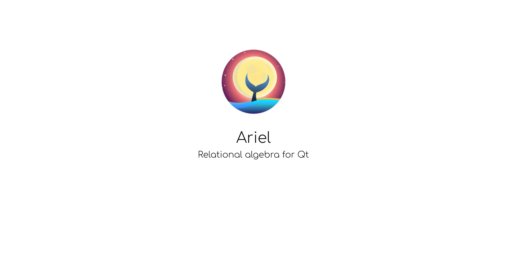

*NOTE: documentation is not finished yet*

**Ariel** is a relational algebra for C++/Qt. Ariel creates an abstract syntax tree (AST) for SQL.
It allows to write and edit queries in a semantic way as a code and not as strings.

The project is inspired by [Arel](https://github.com/rails/rails/tree/master/activerecord/lib/arel)


Here's the code:

```cpp
Ariel::Table posts("posts");
posts.select(posts["title"])
     .where(posts["date"] == QDate::currentDate() && !posts["deleted"])
     .order(posts["id"].ascending())
     .group(posts["category"])
     .skip(30)
     .take(50)
     .toString();

/*
 * Produces:
 * SELECT posts.title FROM posts
 * WHERE posts.date = '2019-08-14' AND posts.deleted = FALSE
 * GROUP BY posts.category
 * ORDER BY posts.id ASC
 * LIMIT 50 OFFSET 30
 */
```

# Table of Contents

- [Get Started](#get-started)
  - [Installation](#installation)
- [Basics](#basics)
- [Output Options](#output-options)
- [Current Status](#current-status)
- [Select Statement](#select-statement)
  - [Projections](#projections)
  - [WHERE clause](#where-clause)
  - [ORDER BY clause](#order-by-clause)
  - [GROUP BY clause](#group-by-clause)
  - [Limit, Offset](#limit-offset)
  - [Compound Select Statements](#compound-select-statements)
- [Insert Statement](#insert-statement)
- [Update Statement](#update-statement)
- [Delete Statement](#delete-statement)
- [Setup Ariel](#setup-ariel)
- [Extend Ariel](#extend-ariel)
- [Copy AST](#copy-ast)
- [SQLITE](#sqlite)

## Get Started

### Installation

*TBD*

#### qbs

Include Ariel library to a qbs project:

```qml
Project {
    references: [
        "<ariel-path>/ariel.qbs"
    ]

    CppApplication {
        Depends { name: "ariel" }
    }
}
```

## Basics

Start with table:
```cpp
Ariel::Table posts("posts");
```

Create attribute (read "column") from the table:

```cpp
Ariel::Attribute id = posts["id"];
Ariel::Attribute title = posts["title"];
```

And then use attributes in methods:
```cpp
posts.select(title);              // SELECT posts.title FROM posts
posts.select({ id, title });      // SELECT posts.id, posts.title FROM posts
```

Ariel supports following SQL statements: `select`, `insert`, `update`, `delete`. For each statement Ariel has tree manager.
Each manager has specific methods for its statement.
```cpp
Ariel::SelectManager selectManager(posts);
Ariel::InsertManager insertManager(posts);
Ariel::UpdateManager updateManager(posts);
Ariel::DeleteManager deleteManager(posts);
```

Tree Manager can be created from `Table`:
```cpp
Ariel::SelectManager selectManager = posts.select(id);
Ariel::InsertManager insertManager = posts.insert(id, 3);
Ariel::InsertManager updateManager = posts.update(id, 3);
```

You don't have to think about tree managers. For simple queries it's more convenient to use method chaining:
```cpp
posts.select({ id, text })
     .where(title == "Welcome")
     .order(id.ascending())
     .toSql();

posts.insert(id, 3)
     .insert(title, "Welcome")
     .toSql();

posts.upate(id, 3)
     .update(title, "Welcome")
     .toSql();
```

## Output options

Tree Manager has two methods for output AST as a string:
- `QString TreeManager::toString()` returns SQL with bound values, it can be useful for debug purposes.
- `QString TreeManager::toSql()` returns SQL with placeholders, it can be useful for creating query.

The difference between `toString()` method and `toSql()` method is shown below:

```cpp
QSqlDatabase::addDatabase("QSQLITE");
Ariel::Table posts("posts");
Ariel::SelectManager selectManager = posts.select(Ariel::Star)
                                          .where(posts["id"] == Ariel::BindValue(3));

qDebug() << selectManager.toString();         // SELECT FROM posts.* WHERE posts.id = 3
qDebug() << selectManager.toSql();            // SELECT FROM "posts".* WHERE "posts"."id" = ?
```

Ariel has an overloaded stream operator for QDebug:
```cpp
qDebug() << posts.select(Ariel::Star);        // SELECT posts.* FROM posts
```

Use `SqlCollector` for access to bound values. Collector encapsulates both SQL string and bound values:
```cpp
const SqlCollector collector = selectManager.build();
const QString sql = collector.value();

QSqlQuery query;
query.prepare(sql);

for (const QVariant &bindValue : collector.bindValues())
    query.addBindValue(bindValue);

query.exec();
```

*NOTE: Ariel doesn't provide interface to execute queries.*


## Current Status

#### Supported dialects
- Common SQL

#### TODO (not implemented)
- Joins
- Top
- Having
- As
- SQL functions (like COUNT, MIN, MAX)

Feel free to create issue with feature request.


## Select Statement

### Projections

```cpp
Ariel::Table posts("posts");
posts.select(Ariel::Star);                    // SELECT posts.* FROM posts
posts.select(posts["title"]);                 // SELECT posts.title FROM posts
posts.select("text");                         // SELECT posts.text FROM posts
posts.select({ "title", "date" });            // SELECT posts.title, posts.date FROM posts
posts.select({ text, title });                // SELECT posts.text, posts.title FROM posts
```

### WHERE clause

#### Comparison operators

```cpp
posts.where(posts["title"] == "Welcome");     // ... WHERE title = 'Welcome'
posts.where(posts["id"] < 3);                 // ... WHERE title < 3
posts.where(posts["id"] == 3);                // ... WHERE title = 3
posts.where(posts["id"] != 3);                // ... WHERE title <> 3
posts.where(posts["deleted"] == true);        // ... WHERE posts.deleted = TRUE
```


#### Logical operators

```cpp
auto id = posts["id"];
auto date = posts["date"];

posts.where(id == 1 && title == "Welcome");   // ... WHERE posts.id = 1 AND posts.title = 'Welcome'
posts.where(id == 1 || title == "Welcome");   // ... WHERE posts.id = 1 OR posts.title = 'Welcome'
posts.where(posts["deleted"]);                // ... WHERE posts.deleted = TRUE
posts.where(!posts["deleted"]);               // ... WHERE posts.deleted = FALSE

posts.where((id == 1 || id == 2)              // ... WHERE (posts.id == 1 OR posts.id = 2)
          && title == Welcome);               //           AND posts.title = 'Welcome'

posts.where((id == 1 && title == "Welcome")   // ... WHERE (posts.id == 1 AND posts.title = 'Welcome')
          || id == 2);                        //           OR posts.id = 2
```

#### Special operators

```cpp
posts.where(posts["id"].isNull());            // ... WHERE posts.id IS NULL
posts.where(posts["id"].isNotNull());         // ... WHERE posts.id IS NOT NULL
posts.where(posts["id"].between(1, 4));       // ... WHERE posts.id BETWEEN 1 AND 4
posts.where(posts["id"].match("a%"));         // ... WHERE posts.id LIKE 'a%'
posts.where(posts["id"].in({ 1, 2, 3 }));     // ... WHERE posts.id IN (1, 2, 3)
posts.where(posts["id"].notIn({ 1, 2, 3 }));  // ... WHERE posts.id NOT IN (1, 2, 3)
```

#### Logical NOT with special operators

```cpp
posts.where(!posts["id"].isNull());           // ... WHERE posts.id IS NOT NULL
posts.where(!posts["id"].isNotNull());        // ... WHERE posts.id IS NULL
posts.where(!posts["id"].between(1, 4));      // ... WHERE posts.id NOT BETWEEN 1 AND 4
posts.where(!posts["id"].match("a%"));        // ... WHERE posts.id NOT LIKE 'a%'
posts.where(!posts["id"].in({ 1, 2, 3 }));    // ... WHERE posts.id NOT IN (1, 2, 3)
posts.where(!posts["id"].notIn({ 1, 2, 3 })); // ... WHERE posts.id IN (1, 2, 3)
```

#### Comparison types

```cpp
auto key = posts["key"];
posts.where(key == "A");                      // ... WHERE posts.key = 'A'
posts.where(key == QString("A"));             // ... WHERE posts.key = 'A'
posts.where(key == 1);                        // ... WHERE posts.key = 1
posts.where(key == QDate::currentDate());     // ... WHERE posts.key = '2019-03-03'
posts.where(key == QVariant());               // ... WHERE posts.key IS NULL
```

#### Compare with an attribute

An attribute may be compared with another attribute

```cpp
posts.where(posts["id1"] == posts["id2"]);    // ... WHERE posts.id1 = posts.id2
```

#### Compare with QStringList

```cpp
const QStringList titles { "wip", "todo", "tbd" };

posts.where(posts["titles"] == titles);       // ... WHERE posts.titles IN ('wip', 'todo', 'tbd')
posts.where(posts["titles"] != titles);       // ... WHERE posts.titles NOT IN ('wip', 'todo', 'tbd')
```

#### Compare with QVariantList

```cpp
const QVariantList values;
values.append(QVariant("a"));
values.append(QVariant("b"));
values.append(QVariant(1));
values.append(QVariant(2));

posts.where(posts["key"] == values);          // ... WHERE posts.key IN ('a', 'b', 1, 2)
posts.where(posts["key"] != values);          // ... WHERE posts.key NOT IN ('a', 'b', 1, 2)
```


### ORDER BY clause

```cpp
posts.order(posts["id"].ascending());         // ... ORDER BY posts.id ASC
posts.order(posts["id"].descending());        // ... ORDER BY posts.id DESC

posts.order(posts["id"].ascending())
     .order(posts["title"].ascending());      // ... ORDER BY posts.id ASC, posts.title ASC
```


### GROUP BY clause

```cpp
posts.group(posts["section"]);                        // ... GROUP BY posts.section
posts.group("section");                               // ... GROUP BY posts.section
posts.group({ posts["section"], posts["category"] }); // ... GROUP BY posts.section, posts.category
posts.group({ "section", "category" });               // ... GROUP BY posts.section, posts.category
```


### Limit, Offset

```cpp
posts.take(10);                               // SELECT posts.* FROM posts LIMIT 10
posts.skip(10);                               // SELECT posts.* FROM posts OFFSET 10
posts.take(20).skip(10);                      // SELECT posts.* FROM posts LIMIT 20 OFFSET 10
```


### Compound Select Statements

Ariel supports compound select statements `UNION`, `UNION ALL`, `INTERSECT`, `EXCEPT`.

Create two select statements:

```cpp
Ariel::Table posts("posts");

auto select1 = posts.select(Ariel::Star)
                    .where(posts["title"] == "Welcome");

auto select2 = posts.select(Ariel::Star)
                    .where(posts["date"] == QDate::currentDate());
```

#### Union

```cpp
SelectManager::distinctUnion(select1, select2);
// or
select1.distinctUnion(select2);

/* Produces:
 * SELECT posts.* FROM posts WHERE posts.title = "Welcome"
 * UNION
 * SELECT posts.* FROM posts WHERE posts.date = '2019-04-14'
 */
```

#### Union all

```cpp
SelectManager::unionAll(select1, select2);
// or
select1.unionAll(select2);

/* Produces:
 * SELECT posts.* FROM posts WHERE posts.title = "Welcome"
 * UNION ALL
 * SELECT posts.* FROM posts WHERE posts.date = '2019-04-14'
 */
```

#### Intersect

```cpp
SelectManager::intersect(select1, select2);
// or
select1.instersect(select2);

/* Produces:
 * SELECT posts.* FROM posts WHERE posts.title = "Welcome"
 * INTERSECT
 * SELECT posts.* FROM posts WHERE posts.date = '2019-04-14'
 */
```

#### Except

```cpp
SelectManager::except(select1, select2);
// or
select1.except(select2);

/* Produces:
 * SELECT posts.* FROM posts WHERE posts.title = "Welcome"
 * EXCEPT
 * SELECT posts.* FROM posts WHERE posts.date = '2019-04-14'
 */
```


## Insert Statement

Insert via table
```cpp
Ariel::Table posts("posts");
posts.insert(posts["title"], "Welcome")
     .insert(posts["date"], QDate::currentDate());

// INSERT INTO posts (title, date) VALUES ('Welcome', '2019-08-14')
```

Insert via `InsertManager`
```cpp
Ariel::Table posts("posts");
Ariel::InsertManager insertManager(posts);
insertManager.insert(posts["title"], "Welcome");
insertManager.insert(posts["date"], QDate::currentDate());

qDebug() << insertManager.toString();

// INSERT INTO posts (title, date) VALUES ('Welcome', '2019-08-14')
```

Insert without relation (table):
```cpp
Ariel::Table posts("posts");
Ariel::Attribute title = posts["title"];

Ariel::InsertManager insertManager;
insertManager.insert(title, "Welcome");       // Relation deduce from an attribute
qDebug() << insertManager.toString();         // INSERT INTO posts (title) VALUES ('Welcome')
```

Insert into select statement:

```cpp
Ariel::Table posts("posts");
Ariel::Attribute title = posts["title"];
Ariel::SelectManager selectStatement = posts.select(title)
                                            .where(title == "Welcome");
Ariel::InsertManager insertManager(posts);
insertManager.column(title)                   // INSERT INTO posts
             .select(selectStatement);        // SELECT posts.title WHERE posts.title = 'Welcome'
```

## Update Statement

Update via table
```cpp
Ariel::Table posts("posts");
posts.update(posts["id"], 3);                 // UPDATE posts SET posts.id = 3
posts.update(posts["id"], 3)
     .update(posts["title"], "Welcome");      // UPDATE posts SET posts.id = 3, title = 'Welcome'

posts.update(posts["title"], "Welcome")       // UPDATE posts SET posts.title = 'Welcome'
     .where(posts["id"] == 3)                 // WHERE posts.id = 3
     .order(posts["date"].ascending())        // ORDER BY ASC
     .take(3);                                // LIMIT 3
```

## Delete Statement

```cpp
Ariel::Table posts("posts");
posts.deleteWhere(posts["id"] == 3);          // DELETE FROM posts WHERE posts.id = 3
posts.deleteWhere(posts["id"] == 3)).take(3); // DELETE FROM posts WHERE posts.id = 3 LIMIT 3
```


## Setup Ariel

*TBD*

## Extend Ariel

*TBD*

## Copy AST

*TBD*

## SQLITE

```cpp
Ariel::Table posts("posts");
auto selectManager = posts.select(Ariel::Star)
                          .where(posts["deleted"] == true);

selectManager.toSql();    // SELECT posts.* FROM posts WHERE posts.deleted = TRUE

QSqlDatabase::addDatabase("QSQLITE");
selectManager.toSql();    // SELECT "posts".* FROM posts WHERE "posts"."deleted" = 1
```

